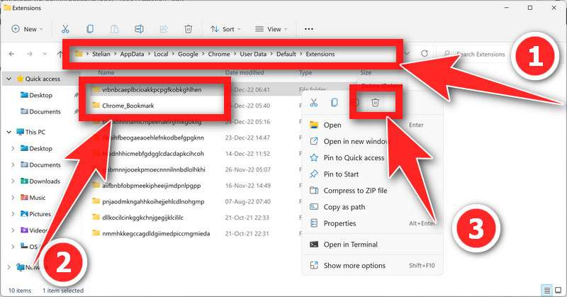

# Shampoo
> This is a malicious adware you may inconciously downloaded and installed into your PC. 
It is nothing but hijacks your browser and gives the highest privilege to itself to manage, change, and collect your data.

:point_right: _**Solution Acknowledgement**_ :point_left: \
The available solution is collected and tested through this site: https://malwaretips.com/blogs/remove-chrome-display/

## How to Manually Remove such headache (Windows)
`Tutorial is suitable for both tech and non-tech people. Do the following copy & paste.`

1. Reset Group Policy (Optional, if you believe group policy is fine, you can go to Step 2)
   1. Open your command prompt as Administrator
   To open the Command Prompt as an administrator in Windows, 
   type `cmd` in the search bar and then right-click on the Command Prompt result and select `Run as administrator` as shown in the image below.
   

   2. Run Commands to Reset Policies
      * Reset group users policy 
      ```bash
        RD /S /Q "%WinDir%\System32\GroupPolicyUsers"
      ```
      * Reset group policy
      ```bash
        RD /S /Q "%WinDir%\System32\GroupPolicy"
      ```
      * Update policies
      ```bash
        gpupdate /force
      ```
      


2. Remove Scheduled Task and Local Files
   1. Search for `Task Scheduler` in the windows search as shown below
   
   2. In the Task Scheduler window, navigate to the `Task Scheduler Library` on the left side of the screen
   
   3. Locate the malicious scheduled task in the list of tasks. Right-click on the malicious task and select **_Delete_** from the menu 
      1. It may have a randomly generated name **_(eg. chrome_display, chrome_Policy, chrome_Bookmarks, chrome_Folder)_** or may be identified as a suspicious or unknown task. \
      > You may concentrate on task name that starts with **chrome** and the format will be _**"  chrome\_\* "**_ 
      
   4. Delete malicious files located in **AppData\Roaming** folder
      1. Press the `Windows + R` button to open the Run app
      
      2. In the text box, type `%AppData%` and click OK. 
      Windows will directly open up the Roaming folder which is inside the AppData folder
      
      3. In the AppData\Roaming folder, search and delete any unknown folders with names, in my case: **_chrome_display_**
      > NOTE that the actual name on your computer may be different, but you should look for programs with similar naming conventions
      ```yaml
      # There are multiple past names
      Markets
      Energy
      Bloom
      Travel
      ```
      4. Delete malicious files located in **AppData\Local** folder
         1. Press the `Windows + R` button to open the Run app
         2. In the text box, enter `%localappdata%` and click OK. Windows will directly open up the AppData\Local folder which is inside the AppData folder.
         
         3. Find the Google folder and Delete Extensions
            ```bash
            Google > Chrome > User Data > Default (or Profile) > Extensions
            ```
            Find the malicious extension folder within the Extensions folder and delete it. 
            It may have a randomly generated name or may be identified as a suspicious or unknown extension, 
         so I recommend you to empty the `/extensions` folder.
         
3. Reset Browser Settings


4. **DONE**
Congratulations!
